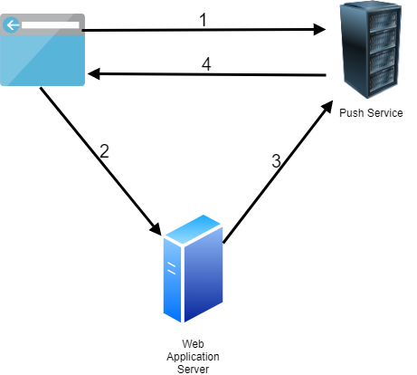
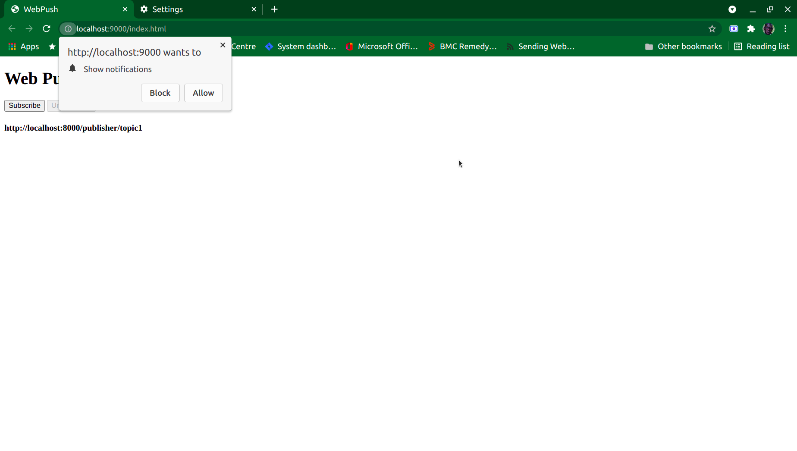
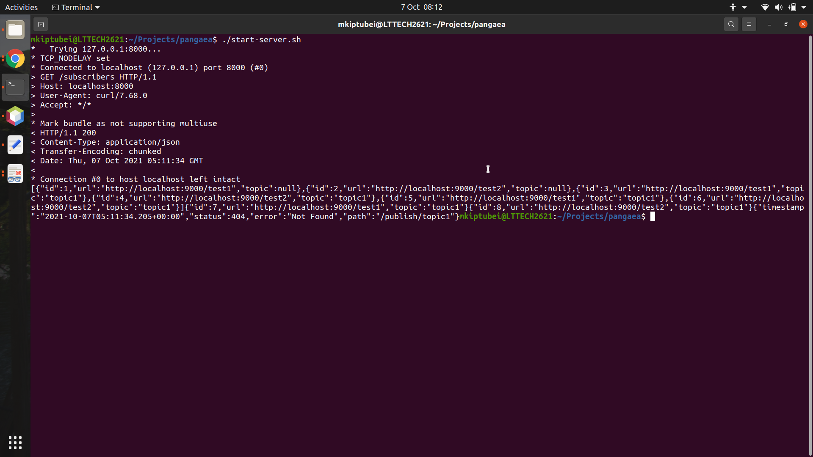

# Pangaea Notification and Subscription Service Part 2 of 2: The Push Service and Web Client
 For this challenge we'll be creating a HTTP notification system. A server (or set of servers) will keep track of topics and subscribers
where a topic is a string and a subscriber is an HTTP endpoint. When a message is published on a topic, it should be forwarded to all subscriber endpoints.

As part of the Pangaea subscription service we must create a Push Service , for notification services our application server cannot directly send notifications to
the browser. This must be done through a push service.	The browser sends a request to the push service and gets back an object with subscription information.

Please note that this repository only contains source code for the web client and the push services as depicted in the Architecture diagram below

Part 1 can be found [here](https://github.com/kiptubei/pangaea.git)

# Project Specification

For a detailed description of the assignement please refer to the 

# Project Architecture

- The application is made up of the parts:
 * Web Client
 * Push Server
 * Api Server / Back-end [pangaea backend source](https://github.com/kiptubei/pangaea.git)
 
- The web client will register a service work and get ack sbscription notification from our push service.

- The browser sends the subscription information to our back end. This information contains a public key, a secret, and the address of the push service.
- Our back end creates, encrypts, and sends push notifications to the push server.
- The browser needs to register a push event listener in the Service Worker code. This handler will receive push notifications even when the web application is
 not open

## Built With

- Spring-Boot
- Java 11
- Apache Netbeans 12.5
- Maven
- Ubuntu 20.04 LTS

### Prerequisites

- Ubuntu
- bash terminal
- Google Chrome

### Usage
- ** Please note these instrcutions require use of Apache Netbeans IDE
- Fork/Clone this project to your local machine with the command `https://github.com/kiptubei/pangaea.git` for PART 1
- Fork/Clone the Push Service to your local machine from `https://github.com/kiptubei/Pangaea-WebPush.git` for PART 2
- Open the project in Apache Netbeans
- Clean and Build with Dependencies
- Run the projects
- Part 1 will run on port 8000 and Part 2 on port 9000

- Execute `.\start-server.sh`

## Author

👤 **Mark James Kiptubei**

- Github: [@kiptubei](https://github.com/kiptubei)
- Twitter: [@mjabei](https://twitter.com/mjabei)
- Linkedin: [Mark James Kiptubei](https://www.linkedin.com/in/kiptubei/)

## 🤝 Contributing

Contributions and feature requests are welcome!

Start by:

- Forking the project
- Clone the project to your local machine by running `https://github.com/kiptubei/Pangaea-WebPush.git`
- `cd` into the project directory
- Run `git checkout -b your-branch-name`
- Make your contributions
- Push your branch up to your forked repository
- Open a Pull Request with a detailed description to the development(or master if not available) branch of the original project for a review

## Show your support

Give a ⭐️ if you like this project!

## Acknowledgments

Dennis Ritchie, Tim Berners Lee, Page and Sergey , et-al
